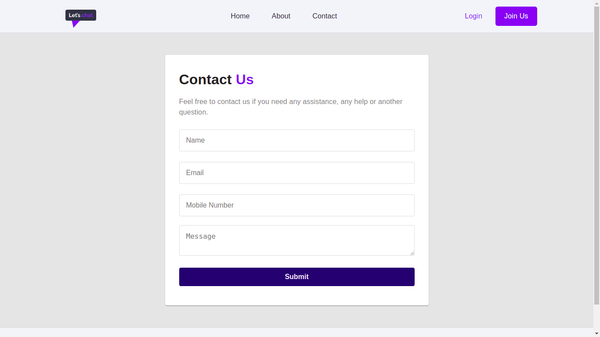
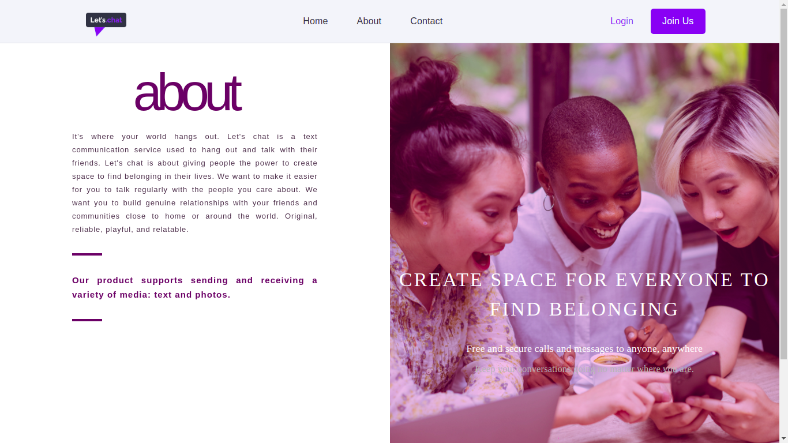
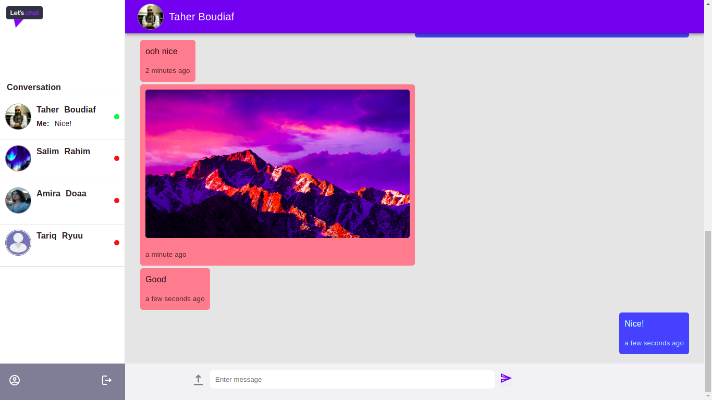
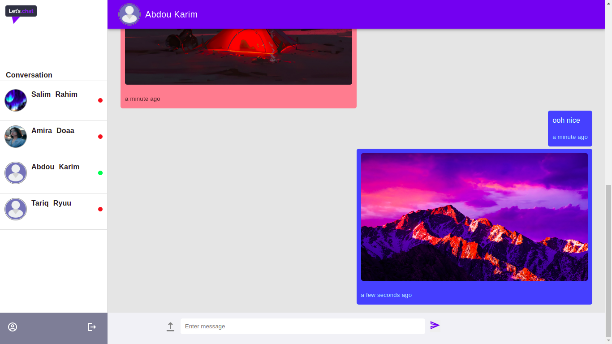
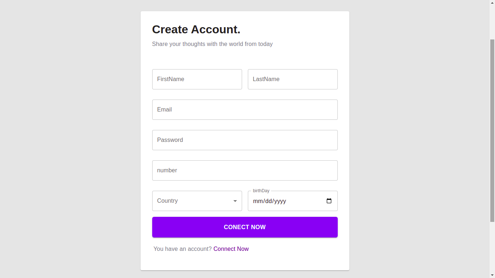
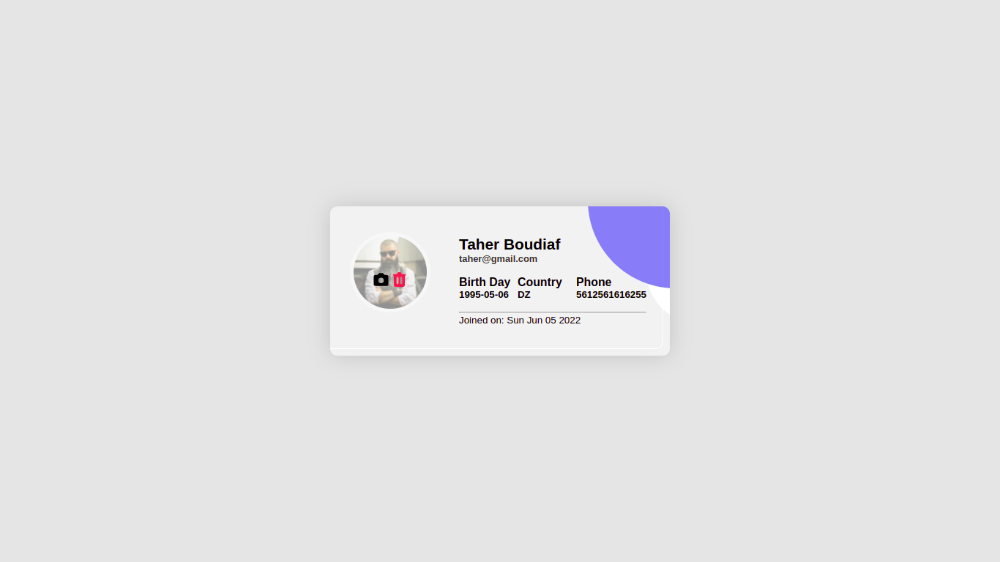

# Let's Chat

Let's chat is a text communication service used to hang out and talk with their friends, 
supports sending and receiving a variety of media: text and photos.
#Link

lets-chat-three.vercel.app

# ScreenShot









# Technologies used

* React 
* MaterialUi
* Firebase(auth,firestore)

# Functions

* log in 
* log out
* upload image to profile
* sending / receiving : image in chat

# Installing dependencies

This repo uses Yarn and npm to install dependencies run this command :

```
npm install 
yarn 
```
# Usage

Before you run the project, make sure to create a `.env.local` file ,add your `config` firebase 
 - To run the project:

```
npm start / yarn start
```

